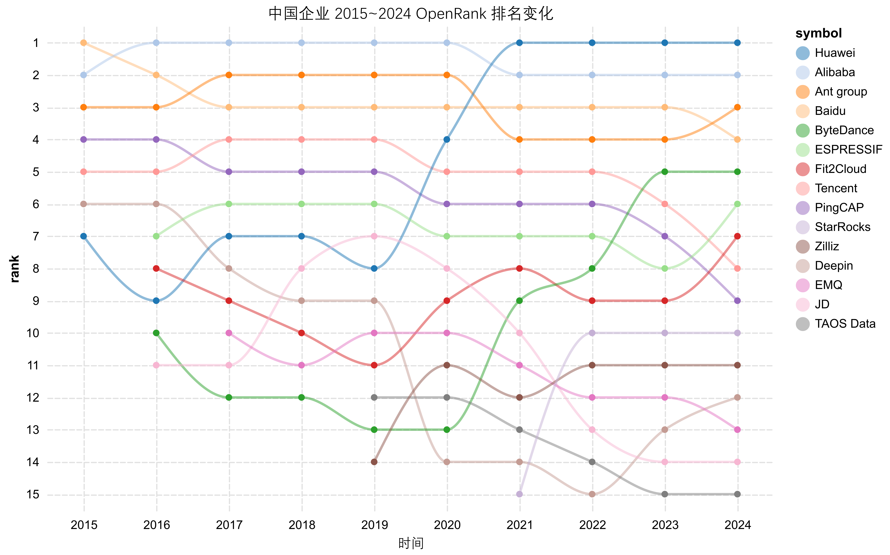
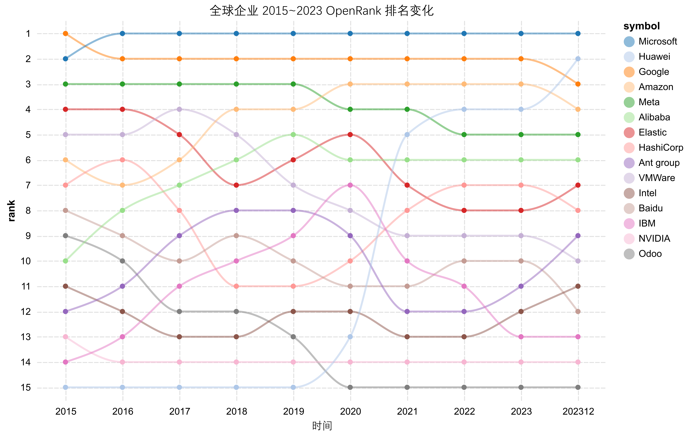

# 企业开源洞察

## 结果展示





## 项目结构（预想）

```text
project_name/
├── pyproject.toml
├── poetry.lock
├── README.md
├── config.py
├── data/
│   ├── raw/
│   └── processed/
├── models/
│   ├── model.pkl
│   └── model_weights.h5
├── code/
│   ├── main.ipynb
│   └── utils.py
└── docs/
    └── report.pdf
```
